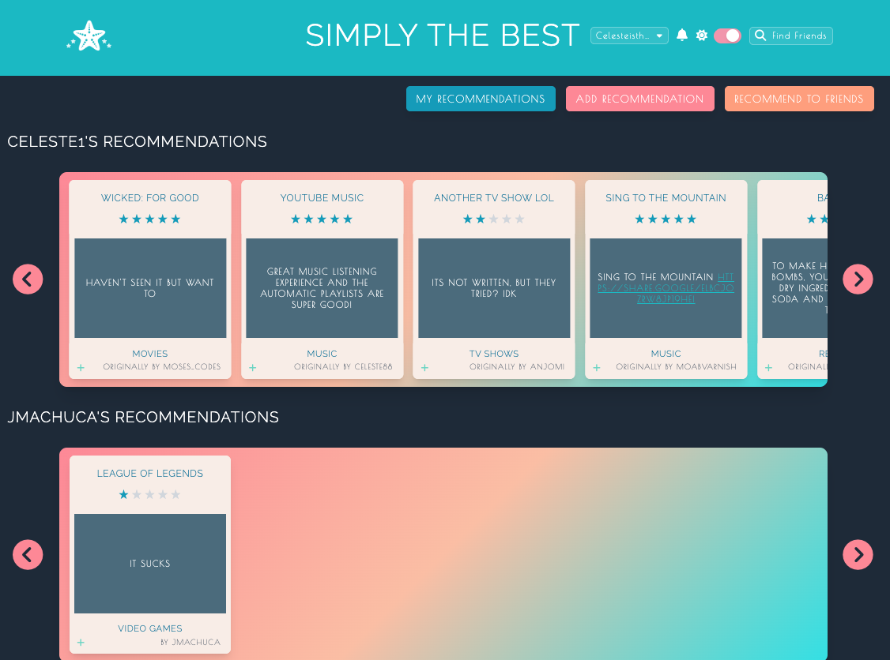
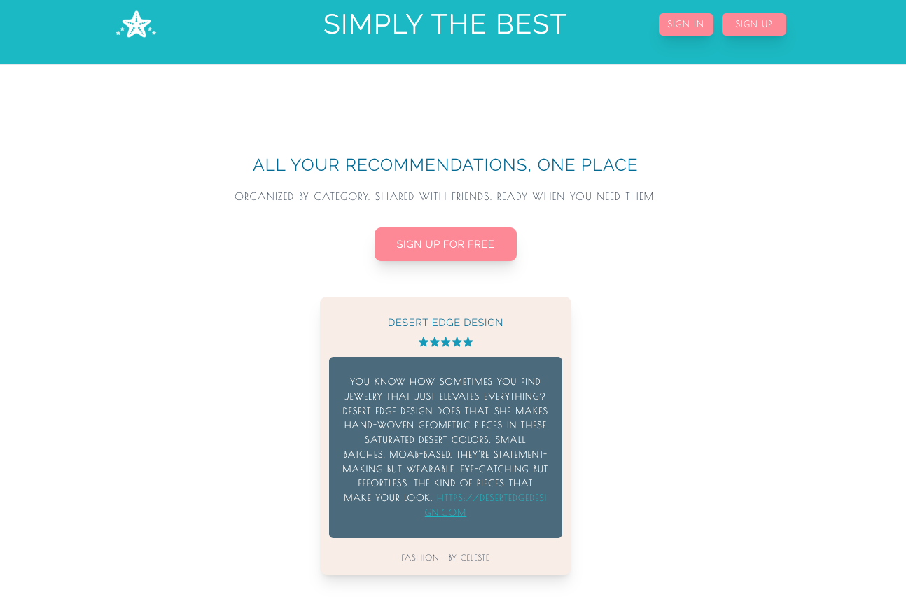
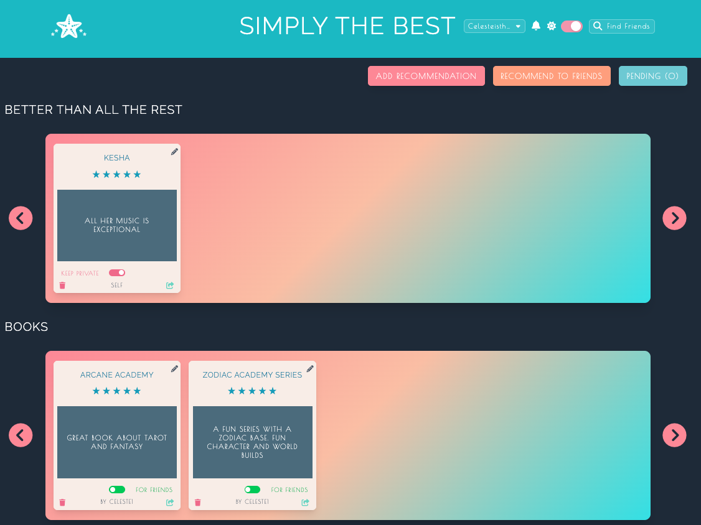
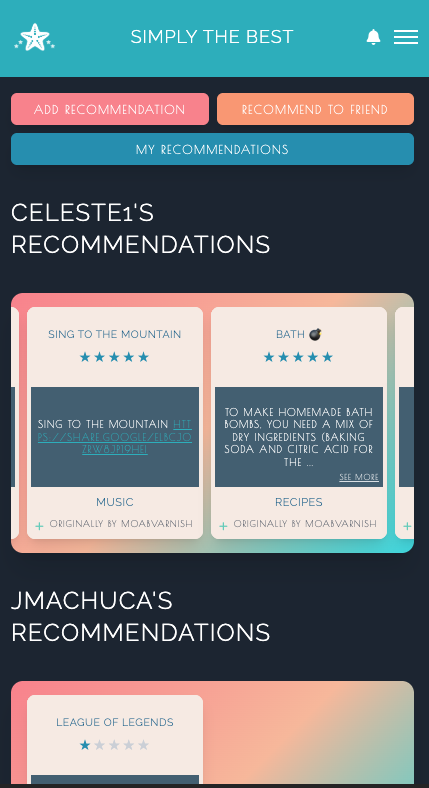

# Simply The Best

_Organize your recommendations by category. Share with friends. Discover what they love._

---

## About

I built Simply The Best because I was sick of losing all the recommendations I'd gotten from friends. I wanted a single place where I could store everything, have it be organized and easy to find.

The idea of seeing what my friends loved really excited me, so I built it as a social platform where we could exchange recommendations and discover what each other are into. Building it from the ground up was a lot of fun. I got to decide exactly what features I wanted and build it to work the way I envisioned.

The result is a platform that works exactly how I want it to, and I'm proud of how it turned out.

---

## Features

**Recommendation Management**

- Create, edit, and organize recommendations by category (movies, restaurants, books, etc.)
- Rate with a 5-star system and add detailed descriptions
- Toggle recommendations between public and private

**Friend System**

- Send and receive friend requests
- View friends' public recommendations in a personalized feed
- Share recommendations directly with specific friends

**Real-Time Notifications**

- Live updates for friend requests, accepted requests, and shared recommendations
- Built with WebSockets for instant communication

**Mobile-First Design**

- Fully responsive across all devices
- Touch-optimized carousel for browsing recommendations
- Swipe-to-delete functionality on mobile

**User Experience**

- Dark mode and light mode support
- Smooth animations and transitions
- Accessible navigation with keyboard support

---

## Screenshots

_Welcome page introducing the platform_

---

_Manage and organize your personal recommendations_

---

### Desktop and Mobile Views

 

_Fully responsive design across all devices_

## Tech Stack

**Frontend**

- React, React Router
- Tailwind CSS
- Context API for state management

**Backend**

- Node.js, Express
- MongoDB with Mongoose
- JWT authentication

**Real-Time Features**

- Socket.io for WebSocket communication

---

## Contact

**Celeste Rhoades**

- Portfolio: [celesterhoadesdesign.com](https://celesterhoadesdesign.com)
- LinkedIn: [linkedin.com/in/celeste-rhoades](https://www.linkedin.com/in/celeste-rhoades/)
- Email: celesterhoadesdesign@gmail.com
